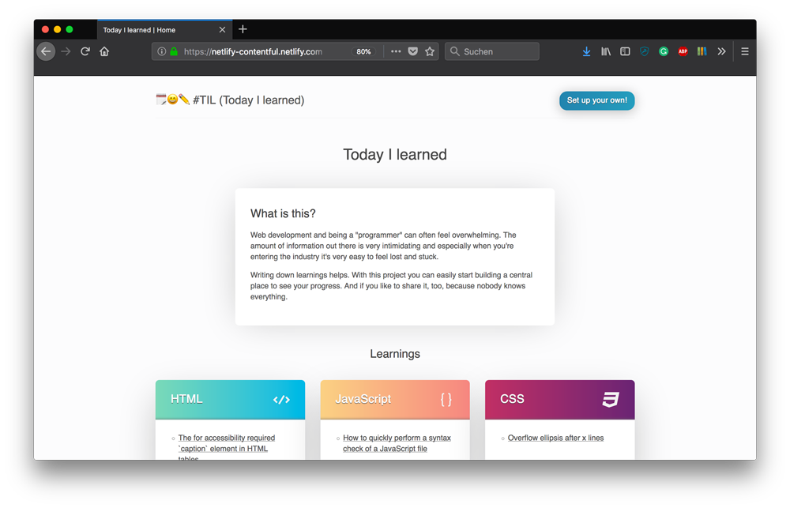

# Today I learned (as static site)

or ... a **"Netlify Contentful React Static Site example"**



_This project is based on [create-react-app](https://github.com/facebook/create-react-app)._

## Features

- an automatic content model setup for a quick-start in Contentful
- dynamic rendering and usage of the [Contentful Preview API](https://www.contentful.com/developers/docs/references/content-preview-api/) for easier content preview in development
- static builds for better user experience using [react-snap](https://github.com/stereobooster/react-snap)
- deploys and CI-flow in Netlify

## Requirements

### [Contentful](https://www.contentful.com) – your Content Infrastructure

Contentful’s content infrastructure is a set of APIs to read, write and preview your data combined with [developer friendly CLI tools](https://github.com/contentful/contentful-cli/) and an [extensible web application](https://www.contentful.com/developers/docs/concepts/uiextensions/) to provide a smooth editorial experience. This set of APIs makes it a perfect fit for modern static site generators that are able to consume API data easily.

### [Netlify](https://www.netlify.com) – your CI service and hoster

Tbd.

## Project setup and initial deploy using the Netlify Deploy Button

[](https://app.netlify.com/start/deploy?repository=https://github.com/stefanjudis/today-i-learned)

This project can be used without files on any computer simply by configuring Contentful and Netlify. The tutorial is [included in the project itself](https://today-i-learned.netlify.com/tutorial/). Go there and have a look in case you have any questions

### Setup of the project for local development

```
$ git clone git@github.com:stefanjudis/today-i-learned.git
$ cd today-i-learned
$ npm i
$ mv .env.sample .env
```

Edit the `.env` to include Contentful credentials of the space you created for the initial flow.

```
REACT_APP_CTF_SPACE=...
REACT_APP_CTF_CDA_TOKEN=...
REACT_APP_CTF_CPA_TOKEN=...
```

### npm start

`npm start` will start a new development server with hot reloading. The cool thing about this command is that the React applications knows that you are in development and uses the Content Preview API. This means, that you will see unpublished and updated data in development which is great to evaluate content changes.

### npm run build

`npm run build` generates a production read bundle including all the CSS and JavaScript and also uses [react-snap](https://github.com/stereobooster/react-snap) to generate static HTML files for every route it can find. This way you don't have to show a loading spinner when you users load the site but rather show the rendered HTML already.
